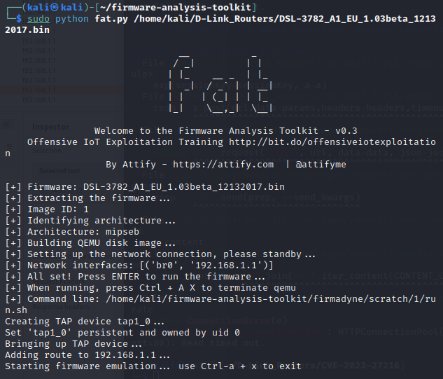
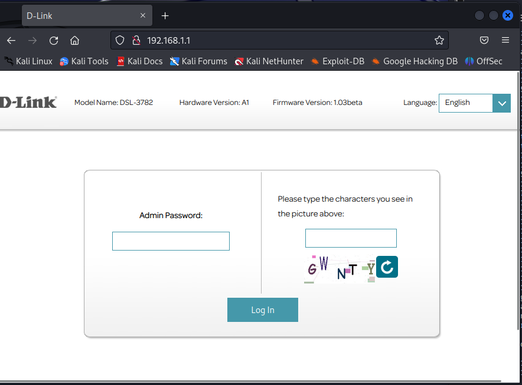
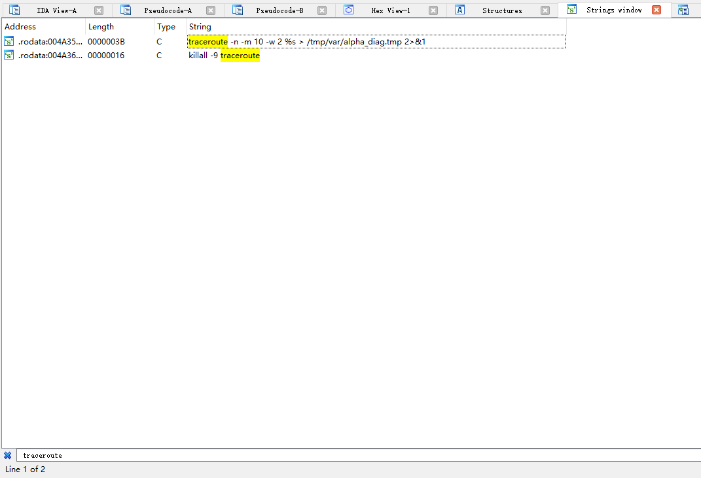
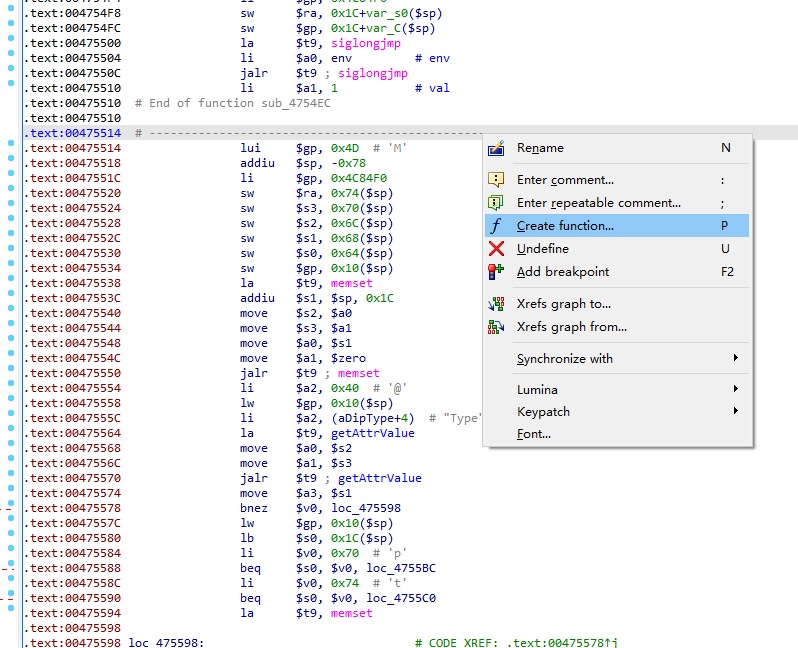
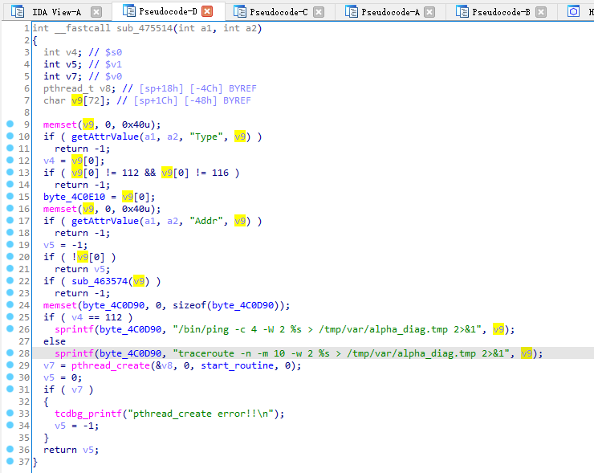
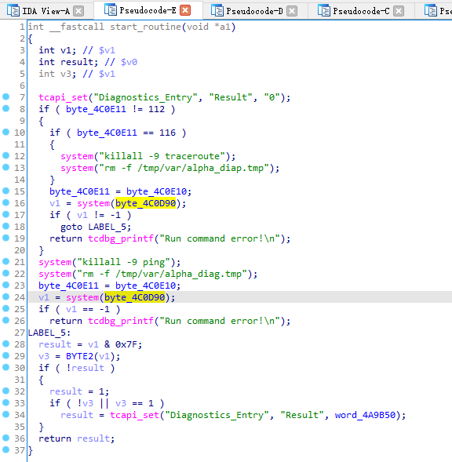
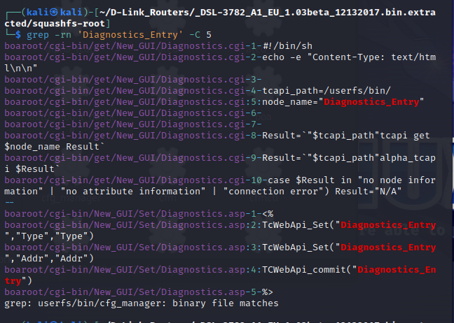
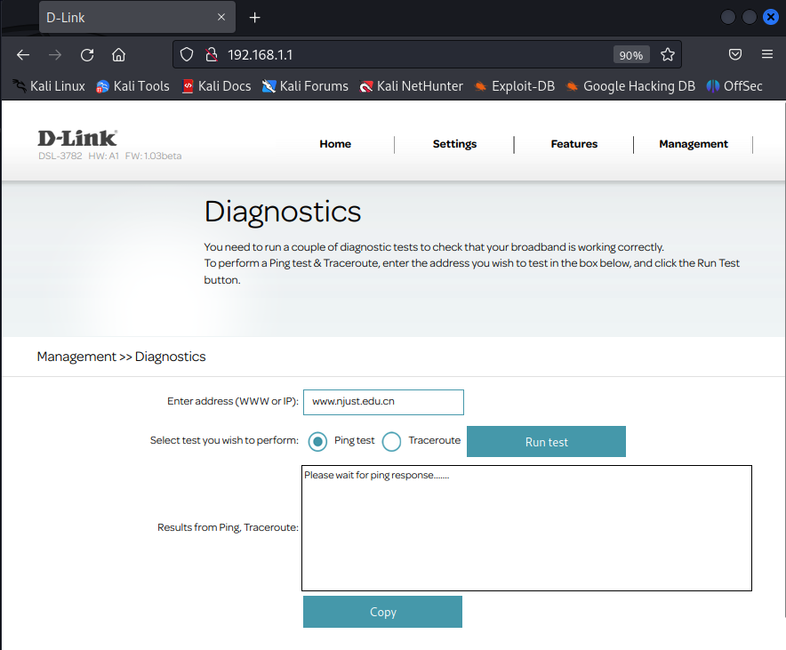
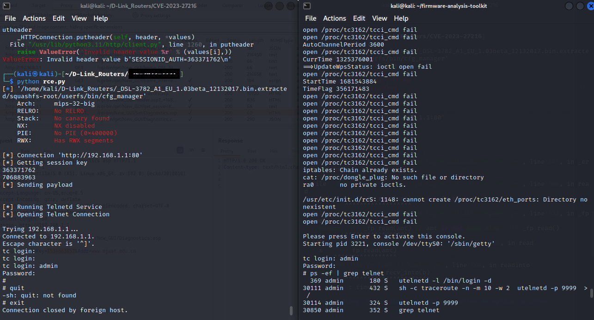
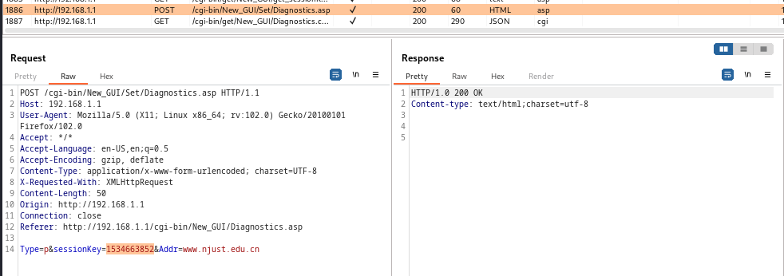

# CVE-2022-34527_D-Link_DSL-3782_Router_command_injection

## 漏洞描述

### 编号

CVE-2022-34527  

### 设备信息

**D-Link DSL-3782 ：**  
DSL-3782_REVA_FIRMWARE_PATCH_v1.03 and below  

### 漏洞类型

RCE

### 危害

可访问路由器的攻击者需凭借凭证方可执行远程代码  

## 复现流程

### 复现设备

**D-Link DSL-3782 ：**  
DSL-3782_REVA_FIRMWARE_PATCH_v1.03_EU_BETA  
DSL-3782_REVA_FIRMWARE_PATCH_v1.01  

### 固件仿真

**DSL-3782_REVA_FIRMWARE_PATCH_v1.03_EU_BETA ：**  
<ftp://FTP2.DLINK.COM/SECURITY_ADVISEMENTS/DSL-3782/REVA/DSL-3782_REVA_FIRMWARE_PATCH_v1.03_EU_BETA.zip>  
or  
<https://support.dlink.com/resource/SECURITY_ADVISEMENTS/DSL-3782/DSL-3782_REVA_FIRMWARE_PATCH_v1.03_EU_BETA.zip>  
**DSL-3782_REVA_FIRMWARE_PATCH_v1.01 ：**  
<https://tsd.dlink.com.tw/asp/get_file.asp?sno=MNIUFMITAMJU>  
fat仿真  
  
console  
  
web_admin  
  

### 漏洞分析

>D-Link DSL-3782 v1.03 and below was discovered to contain a command injection vulnerability via the function byte_4C0160.  

由于复现没有下载到cve作者分析的v1.03的固件，使用的是v1.03_EU_BETA，因此原作者提供的逆向后根据地址命名的`byte_4C0160()`在本复现版本中不存在。根据原作者更多分析的文章  
>Some vulnerabilities (including a stack-based buffer overflow and a command injection) exist in the D-Link DSL-3782 Wi-Fi router 1.01 and 1.03. An authenticated remote attacker can execute arbitrary code via the Addr field in the request sent to the Diagnostics.asp page. Different from CVE-2018-8941, the vulnerable binary program is cfg_manager, which is used to perform tracroute or ping functions. And according to our testing, these vulnerabilities still exist on the latest firmware (v1.03) of this router.  

找到问题binary  
  
  
找到用`%s`拼接指令的点  
  
  
用`sprintf()`进行拼接  
  
反编译下看得更清楚，往上找到头创建函数  
  
  
  
用`sprintf()`将v9拼接到`byte_4C0D90`中，向下跟`pthread_create()`创建的`start_routine()`，`system()`执行拼接的`byte_4C0D90`，即找到sink点  
  
至于source向上跟`getAttrValue()`能力有限，没跟出结果。  
不过这套 boa 的 webserver 通常是 boa 负责认证、 cfg_manager 实现 admin 具体功能。`boa::TCWebApi_set()`调用`libtcapi::tcapi_set()`传给cfg_manager，cfg_manager调用`tcapi_get`获得post来的内容。根据`start_routing()`里的node_name : **Diagnostics_Entry** 可以定位到 boa 传来的`Addr`到`v9`  
  
问题页面  
  
rce  
  

### 漏洞利用

以v1.03为例，需要输入session  
  
session  
  
